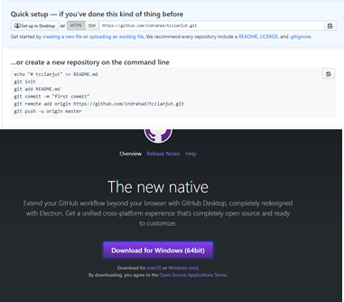
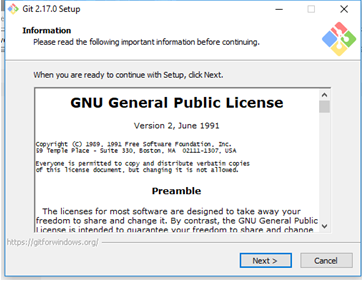
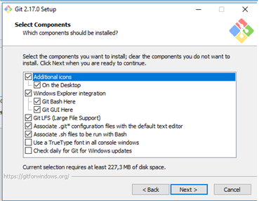
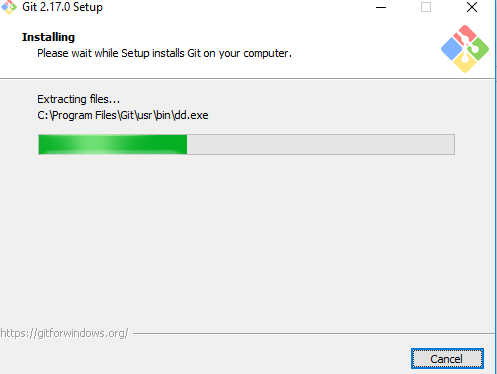
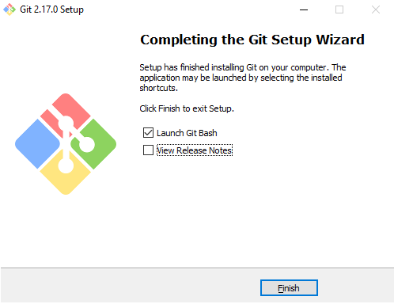
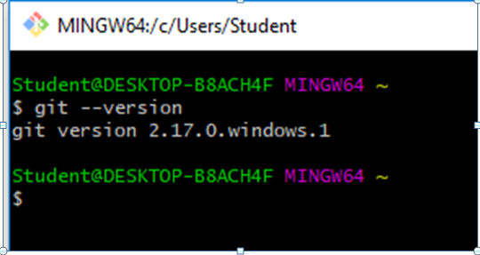

# Instalasi GIT di oprating system Windows 10

## Download master git untuk windows
 
 
## Memulai Proses Instalasi

## Memilih Komponen yang perlu di install

## Proses instalasi berjalan

 
## Proses instalasi berhasil

## Mencoba menjalankan Git Bash dan cek version

 
 
 
 
 
 
 
 
  
 
 

 

